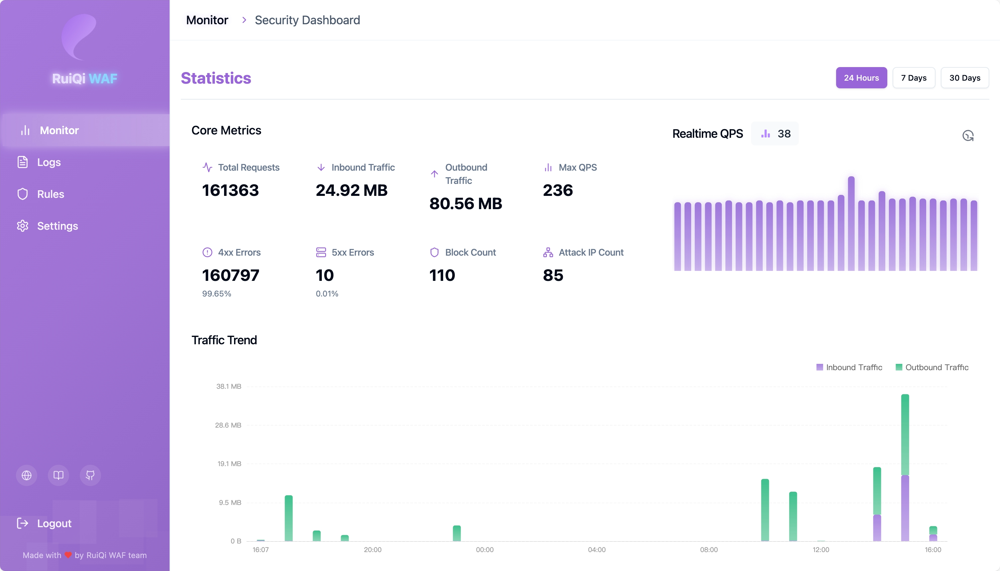
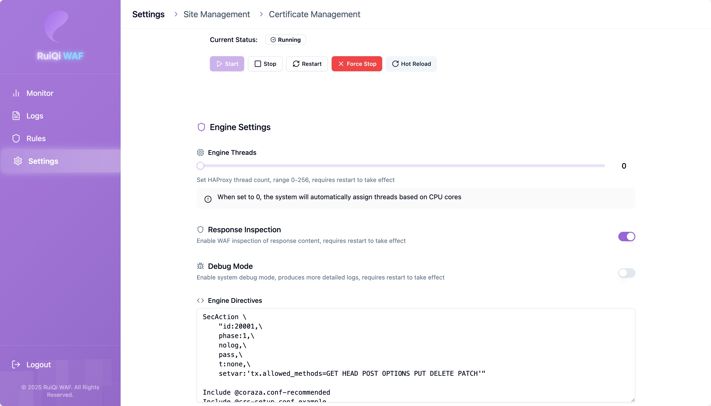
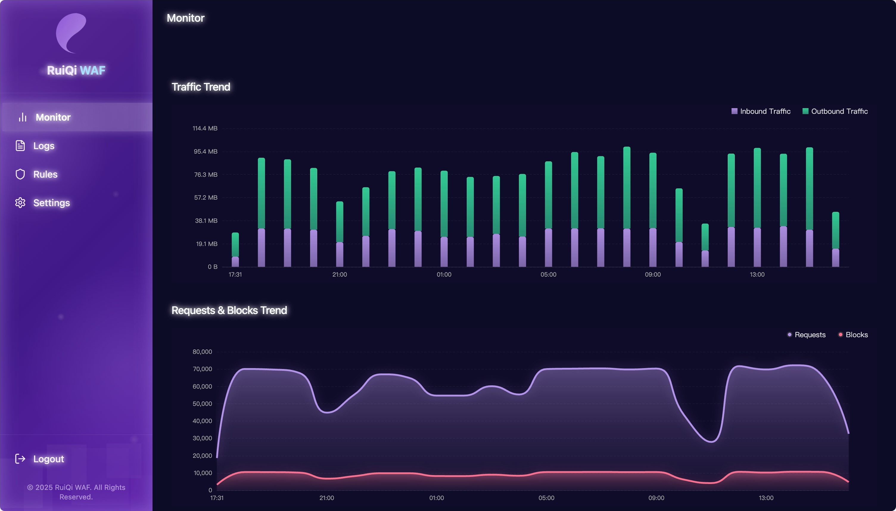
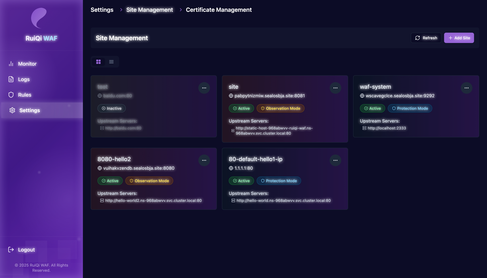

# MRYa WAF (AI-Waf)

<div align="center">

[](https://go.dev/)
[](https://www.haproxy.org/)
[](https://github.com/corazawaf/coraza)
[](https://www.mongodb.com/)
[](https://react.dev/)
[](./LICENSE)

</div>

一个基于 `HAProxy + OWASP Coraza + Go + React` 的现代化 Web 应用防火墙管理平台，提供从流量接入、防护策略、日志告警到 AI 辅助分析的完整闭环能力。

## 目录

- [项目亮点](#项目亮点)
- [功能截图](#功能截图)
- [核心功能](#核心功能)
- [架构概览](#架构概览)
- [快速开始](#快速开始)
- [配置说明](#配置说明)
- [文档导航](#文档导航)
- [贡献指南](#贡献指南)
- [版本路线图](#版本路线图)
- [许可证](#许可证)

## 项目亮点

- 多引擎防护：Coraza WAF + MicroEngine + 地理分析 + 限流控制
- 管理闭环：站点、证书、规则、日志、告警、统计一体化
- AI 增强：DeepSeek 对话分析 + MCP 工具化操作
- 开源友好：模块化目录、清晰接口、可容器化部署

## 功能截图

> 截图来自当前 Web 控制台，位于 `doc/image/`。






## 核心功能

### 1. 防护与策略
- Coraza WAF（兼容 ModSecurity/SecLang，支持 CRS）
- MicroEngine 微规则引擎：
  - 支持 `IP/URL/Path` 匹配目标
  - 支持嵌套条件与 `AND/OR` 复合逻辑
  - 支持黑白名单与 CIDR
- 自适应限流（Adaptive Throttling）
- 地理位置分析与攻击来源可视化

### 2. 平台管理
- 站点管理（多站点、多后端）
- 证书管理（HTTPS 配置）
- 规则管理（创建、更新、启停、删除）
- IP 封禁与解封

### 3. 监控与告警
- 攻击日志查询与过滤
- 安全指标统计与趋势分析
- 告警规则、告警通道、告警历史

### 4. AI 与 MCP
- AI 助手（DeepSeek）用于日志分析、规则建议
- MCP Server 工具化接入（可由 Claude Desktop/Agent 调用）

## 架构概览

请求链路：

1. 业务请求进入 HAProxy
2. HAProxy 通过 SPOE 与 `coraza-spoa` 交互
3. Coraza 对请求/响应进行检测
4. 微引擎规则参与联合决策（放行/阻断/记录）
5. `server` 提供管理 API 与数据聚合
6. `web` 提供可视化配置与运营界面
7. `mcp-server` 暴露工具能力供 AI 工作流调用

更多系统描述见 `SYSTEM_OVERVIEW.md`。

## 快速开始

### 方式一：Docker Compose（推荐）

1. 在项目根目录创建或修改 `.env`
2. 启动服务：

```bash
docker compose up -d --build
```

3. 访问地址：
- 控制台：`http://localhost:2333`
- 健康检查：`http://localhost:2333/health`
- Swagger：`http://localhost:2333/swagger/index.html`
- ReDoc：`http://localhost:2333/redoc`

默认初始账号（首次登录请立即修改）：
- 用户名：`admin`
- 密码：`admin123`

### 方式二：本地开发

前置依赖：
- Go `1.24.1+`
- Node.js `23.10.0+`
- pnpm `10.11.0+`
- MongoDB `6.0+`
- HAProxy `3.0+`（本地联调可选）

```bash
# 后端
cd server
go run main.go

# 前端（另一个终端）
cd web
pnpm install
pnpm dev
```

## 配置说明

核心配置在根目录 `.env`，关键项包括：

- `JWT_SECRET`：JWT 密钥（必须使用高强度随机串）
- `MONGO_ROOT_PASSWORD`：MongoDB 密码
- `VITE_API_BASE_URL`：前端 API 地址
- `DEEPSEEK_API_KEY`：AI 助手密钥（可选）
- `MCP_API_TOKEN`：MCP 服务调用令牌

详细参考：`ENV_CONFIG_GUIDE.md`。

## 文档导航

- `SYSTEM_OVERVIEW.md`：系统总览与组件关系
- `ENV_CONFIG_GUIDE.md`：环境变量与配置说明
- `MCP_SETUP_GUIDE.md`：MCP 部署、配置、故障排查
- `QUICK_REFERENCE.md`：MCP 工具参数速查
- `AI_ASSISTANT_GUIDE.md`：DeepSeek AI 助手集成
- `SECURITY_AUDIT_REPORT.md`：安全审计结果

### 提案文档（`doc/proposal`）

- `micro_engine_design_zh.md` / `micro_engine_design.md`
  - 微引擎规则执行模型、优先级、复合条件与匹配流程
- `condition-bulid.md` / `condition-build-en.md`
  - 前端递归条件构建器（ConditionBuilder）设计与数据流

## 贡献指南

欢迎通过 Issue 和 Pull Request 参与贡献。

### 提交前建议

1. Fork 并创建分支：`feature/<name>` 或 `fix/<name>`
2. 保持单一变更主题，避免一个 PR 混入多类改动
3. 对关键变更附带说明：
   - 背景问题
   - 方案与影响范围
   - 验证方式

### 本地检查建议

```bash
# 后端（示例）
cd server
go test ./...
go vet ./...

# 前端（示例）
cd web
pnpm install
pnpm lint
pnpm build
```

### PR 模板建议内容

- 变更摘要
- 兼容性影响
- 测试结果
- 截图（若涉及前端）

## 版本路线图

### v1.1（短期）
- [ ] 完善安全指标看板
- [ ] 告警通道增强（Webhook/IM）
- [ ] 更多规则模板（OWASP Top 10）

### v1.2（中期）
- [ ] AI 规则建议自动评分
- [ ] 自适应限流策略优化
- [ ] MCP 工具集扩展（更细粒度运维能力）

### v2.0（长期）
- [ ] 多节点高可用部署方案
- [ ] 更完整的策略编排与回滚机制
- [ ] 更丰富的生态集成（SIEM/SOAR）

## 许可证

本项目采用 MIT 许可证，详见 `LICENSE`。

## 致谢

- [OWASP Coraza WAF](https://github.com/corazawaf/coraza)
- [Coraza SPOA](https://github.com/corazawaf/coraza-spoa)
- [HAProxy](https://www.haproxy.org/)
- [Gin](https://github.com/gin-gonic/gin)
