# AI 攻击模式分析与规则生成流程

## 概述

展示从 WAF 攻击日志中自动发现攻击模式、生成防护规则的完整 AI 分析管道。

核心代码位置：
- 定时任务编排：`server/service/cornjob/ai_analyzer/ai_analyzer_task.go`
- AI 分析引擎：`coraza-spoa/analyzer/analyzer.go`
- 服务层编排：`server/service/ai_engine.go`

## 流程图

```mermaid
flowchart LR
    subgraph trigger ["Trigger"]
        cronTask["Cron Job Hourly"]
        manualCall["Manual Trigger"]
    end

    subgraph dataCollection ["Data Collection"]
        fetchLogs["Fetch WAF Logs 24h"]
        checkSamples{"Samples > 100?"}
        skipAnalysis["Skip Analysis"]
    end

    subgraph featureEngineering ["Feature Engineering"]
        extractFeat["Extract Features"]
        aggregate["Aggregate Features"]
        enrich["Enrich with GeoIP"]
    end

    subgraph patternDetection ["Pattern Detection"]
        clusterAnalysis["Cluster Analysis"]
        statAnalysis["Statistical Analysis"]
        detectPatterns["Identify Patterns"]
        classifySeverity{"Classify Severity"}
    end

    subgraph ruleGeneration ["Rule Generation"]
        filterHighRisk["Filter High Risk"]
        generateRule["Generate Rule"]
        deDuplicate{"Dedup Existing?"}
        saveRule["Save to generated_rules"]
    end

    subgraph reviewDeploy ["Review and Deploy"]
        manualReview["Manual Review"]
        approveAction{"Approve?"}
        deployRule["Deploy to Engine"]
        rejectRule["Reject 30d Cleanup"]
    end

    subgraph storage ["Storage"]
        wafLogs[(WAF Attack Logs)]
        patterns[(Attack Patterns)]
        genRules[(Generated Rules)]
        microRules[(Micro Rules)]
    end

    cronTask --> fetchLogs
    manualCall --> fetchLogs
    fetchLogs --> checkSamples
    checkSamples -->|"No"| skipAnalysis
    checkSamples -->|"Yes"| extractFeat
    extractFeat --> wafLogs
    extractFeat --> aggregate
    aggregate --> enrich
    enrich --> clusterAnalysis
    clusterAnalysis --> statAnalysis
    statAnalysis --> detectPatterns
    detectPatterns --> patterns
    detectPatterns --> classifySeverity
    classifySeverity --> filterHighRisk
    filterHighRisk --> generateRule
    generateRule --> deDuplicate
    deDuplicate -->|"Yes"| genRules
    deDuplicate -->|"No"| saveRule
    saveRule --> genRules
    genRules --> manualReview
    manualReview --> approveAction
    approveAction -->|"Yes"| deployRule
    approveAction -->|"No"| rejectRule
    deployRule --> microRules
    rejectRule -.->|"30d cleanup"| genRules

    style trigger fill:#FFECBD,stroke:#FFC943
    style dataCollection fill:#C2E5FF,stroke:#3DADFF
    style featureEngineering fill:#C6FAF6,stroke:#5AD8CC
    style patternDetection fill:#DCCCFF,stroke:#874FFF
    style ruleGeneration fill:#FFE0C2,stroke:#FF9E42
    style reviewDeploy fill:#CDF4D3,stroke:#66D575
    style storage fill:#D9D9D9,stroke:#B3B3B3
    style skipAnalysis fill:#FFCDC2,stroke:#FF7556
    style rejectRule fill:#FFCDC2,stroke:#FF7556
    style deployRule fill:#CDF4D3,stroke:#66D575
    style checkSamples fill:#FFECBD,stroke:#FFC943
    style classifySeverity fill:#FFECBD,stroke:#FFC943
    style deDuplicate fill:#FFECBD,stroke:#FFC943
    style approveAction fill:#FFECBD,stroke:#FFC943
```



## 阶段说明

### 阶段 1：触发机制（Trigger）

| 触发方式 | 实现 | 频率 |
|----------|------|------|
| 定时任务 | `AIAnalyzerTask.Start()` 注册 Cron 表达式 `"0 * * * *"` | 每小时 |
| 手动触发 | `POST /api/v1/ai-analyzer/trigger` → `AIAnalyzerTask.RunNow()` | 按需 |
| 数据清理 | Cron `"0 2 * * *"` 每天凌晨 2 点删除 30 天前的被拒规则 | 每天 |

### 阶段 2：数据采集（Data Collection）

- 从 MongoDB `waf_log` 集合拉取最近 **24 小时**的攻击日志
- 最小样本数阈值：**100 条**
- 不足 100 条 → 跳过本轮分析，等待下一周期
- 足够 → 进入特征工程阶段

### 阶段 3：特征工程（Feature Engineering）

核心组件：`coraza-spoa/analyzer/feature_extractor.go` — `FeatureExtractor`

```
原始日志 → ExtractFeatures() → 特征向量 → AggregateFeatures() → 聚合特征
```

**提取的特征维度：**

| 特征类型 | 字段 | 说明 |
|----------|------|------|
| 来源特征 | `src_ip`, `geo_country`, `geo_asn` | 攻击源 IP + GeoIP 地理位置 |
| 目标特征 | `domain`, `path`, `method` | 攻击目标 URL |
| 规则特征 | `rule_id`, `severity`, `phase` | 触发的 WAF 规则信息 |
| 时间特征 | `timestamp`, `hour`, `date` | 攻击发生的时间维度 |
| 载荷特征 | `payload_length`, `payload_pattern` | 攻击载荷特征 |

### 阶段 4：模式检测（Pattern Detection）

核心组件：`coraza-spoa/analyzer/pattern_detector.go` — `AttackPatternDetector`

| 子步骤 | 方法 | 说明 |
|--------|------|------|
| 聚类分析 | KMeans / DBSCAN | 将相似攻击特征归为同一模式 |
| 统计分析 | 异常阈值 2.0σ | 检测偏离正常流量的异常行为 |
| 模式识别 | `DetectPatterns()` | 输出 `[]*model.AttackPattern` |
| 严重度分级 | `classifySeverity` | 分为 `low`/`medium`/`high`/`critical` |

**配置参数：**
- `MinSamples`: 100（最小样本数）
- `AnomalyThreshold`: 2.0（异常检测标准差阈值）
- `ClusteringMethod`: "kmeans" | "dbscan"
- `TimeWindowHours`: 24（分析时间窗口）

### 阶段 5：规则生成（Rule Generation）

核心组件：`coraza-spoa/analyzer/rule_generator.go` — `RuleGenerator`

```
高危模式(high/critical) → GenerateRule() → 规则 → 去重检查 → generated_rules
```

| 子步骤 | 说明 |
|--------|------|
| 过滤高风险 | 仅对 severity == "high" 或 "critical" 的模式生成规则 |
| 生成规则 | 将攻击模式自动转换为 MicroRule 格式（匹配条件 + 动作） |
| 去重检查 | 与已有的 `micro_rules` 和 `generated_rules` 比较 |
| 新规则 | 存入 `generated_rules` 集合，状态 `pending`，置信度阈值 0.7 |
| 已存在 | 跳过，避免重复创建 |

### 阶段 6：审核与部署（Review & Deploy）

需要**人工审核**确认后方可部署到生产引擎。

| 操作 | API | 说明 |
|------|-----|------|
| 列出待审核 | `GET /api/v1/ai-analyzer/rules/pending` | 查看所有 pending 状态规则 |
| 批准 | `POST /api/v1/ai-analyzer/suggestions/:id/approve` | 规则进入待部署队列 |
| 部署 | `POST /api/v1/ai-analyzer/rules/:id/deploy` | 写入 `micro_rules`，调用 `ruleEngine.ReloadFromMongoDB()` 热加载 |
| 拒绝 | `POST /api/v1/ai-analyzer/suggestions/:id/reject` | 状态变为 `rejected`，30 天后自动清理 |
| 手动分析 | `POST /api/v1/ai-analyzer/analyze/patterns` | 针对指定模式分析 |

## 数据存储

| 集合 | 用途 | 生命周期 |
|------|------|----------|
| `waf_log` | WAF 原始攻击日志（输入） | 持久保留 |
| `attack_patterns` | 检测到的攻击模式 | 持久保留 |
| `generated_rules` | AI 生成的规则 | rejected 规则 30 天后清理 |
| `micro_rules` | 生效中的业务规则 | 持久保留 |
| `ai_analyzer_configs` | 分析器配置 | 持久保留 |

## 关键代码引用

| 文件 | 功能 |
|------|------|
| `server/service/cornjob/ai_analyzer/ai_analyzer_task.go` | 定时任务编排（Cron调度） |
| `server/service/ai_engine.go` | AI 引擎服务层（负责串联调用） |
| `coraza-spoa/analyzer/analyzer.go` | AI 安全分析器（核心组件） |
| `coraza-spoa/analyzer/pattern_detector.go` | 攻击模式检测器 |
| `coraza-spoa/analyzer/feature_extractor.go` | 特征提取器 |
| `coraza-spoa/analyzer/rule_generator.go` | 规则生成器 |
| `server/controller/ai_analyzer.go` | AI 分析器 HTTP 接口 |
| `coraza-spoa/internal/micro_engine.go` | MicroEngine（热加载生成的规则） |
