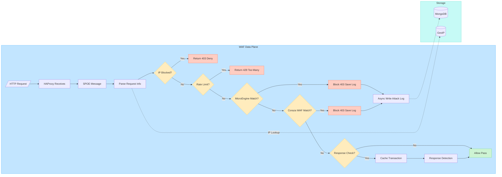

# WAF 数据面请求检测流程

## 概述

展示 HAProxy 通过 SPOE 协议将请求卸载给 Coraza WAF 引擎的完整检测链路。代码入口位置：`coraza-spoa/internal/application.go` — `HandleRequest()` 和 `HandleResponse()` 方法。

## 流程图

## 流程说明

### 1. 请求解析（Parse Request Info）

HAProxy 将 HTTP 请求的以下信息通过 SPOE 协议发送给 coraza-spoa Agent：

| 字段 | 说明 |
|------|------|
| `src-ip` | 客户端源 IP |
| `src-port` | 客户端源端口 |
| `dst-ip` | 目标服务器 IP |
| `dst-port` | 目标服务器端口 |
| `method` | HTTP 方法 (GET/POST/...) |
| `path` | 请求路径 |
| `query` | 查询参数 |
| `version` | HTTP 版本 |
| `headers` | 请求头 |
| `body` | 请求体 |
| `id` | 唯一请求 ID (HAProxy unique-id) |

Agent 会先从请求头中提取真实客户端 IP（遍历 X-Forwarded-For, X-Real-IP, CF-Connecting-IP 等），同时通过 `Host` 头确定目标域名。

### 2. IP 封禁检查（IP Blocked Check）

- 调用 `ipRecorder.IsIPBlocked(realIP)` 检查 IP 是否在封禁列表中
- 底层存储：MongoDB 中的 `blocked_ips` 集合
- **命中**：返回 403，附带封禁原因和截止时间
- **未命中**：进入下一阶段

### 3. 频率限制检查（Rate Limit Check）

- 调用 `flowController.CheckVisit(realIP, url)` 检查请求频率
- 底层组件：`coraza-spoa/internal/flow-controller/` 包
- 支持自适应限流（基于历史流量模式动态调整阈值）
- **超限**：返回 429 Too Many Requests
- **正常**：进入下一阶段

### 4. MicroEngine 业务规则匹配

- 调用 `ruleEngine.MatchRequest(realIP, url, path)` 匹配业务级规则
- 底层组件：`coraza-spoa/internal/micro_engine.go`
- 规则从 MongoDB 热加载（支持 `ReloadFromMongoDB` 热更新）
- **匹配方式**：equal, not_equal, fuzzy, in_cidr, not_in_cidr, in_ipgroup, not_in_ipgroup, include, contains, not_contains, prefix_keyword, regex
- **命中**：返回 403，记录攻击日志 → MongoDB `waf_log` 集合并通知 `flowController.RecordAttack`
- **未命中**：进入 Coraza WAF

### 5. Coraza WAF 规则匹配

- OWASP Coraza v3 WAF 引擎，使用 OWASP Core Rule Set (CRS)
- 执行阶段：`ProcessConnection` → `ProcessURI` → `ProcessRequestHeaders` → `ProcessRequestBody`
- **命中**：返回 403，记录完整的匹配规则信息（规则ID、严重度、阶段、Payload 等）到 MongoDB
- **未命中**：继续处理

### 6. 响应检查（Response Check）

- 仅当 `ResponseCheck` 配置开启时生效
- 请求阶段未拦截时：将 `Transaction` 缓存到 `cache.ExpiringCache`（默认 TTL 10s）
- HAProxy 收到后端响应后，再次通过 SPOE 发送响应消息
- Agent 从缓存中取出 Transaction，执行 `ProcessResponseHeaders` → `ProcessResponseBody`
- 响应阶段被拦截同样记录攻击日志

### 7. 异步日志写入

- 通过 `LogStore` 接口的 `logStore.Store(firewallLog)` 方法异步写入
- 实际实现：`MongoLogStore`（`coraza-spoa/internal/log_store.go`）
- 使用**批量写入 + 对象池**优化：`LogBatch` + `batchPool` (sync.Pool)
- 日志内容包括：请求原文、响应原文、规则匹配信息、GeoIP 信息、时间戳等

---

## 关键代码引用

| 文件 | 功能 |
|------|------|
| `coraza-spoa/internal/agent.go` | SPOE Agent 入口，接收 HAProxy 消息 |
| `coraza-spoa/internal/application.go:127` | `HandleRequest()` 请求处理主逻辑 |
| `coraza-spoa/internal/application.go:483` | `HandleResponse()` 响应处理逻辑 |
| `coraza-spoa/internal/micro_engine.go` | MicroEngine 规则引擎 |
| `coraza-spoa/internal/ip_processor.go` | GeoIP 处理器 |
| `coraza-spoa/internal/log_store.go` | MongoDB 异步日志存储 |
| `coraza-spoa/internal/flow-controller/` | 流量控制（限流 + IP 封禁） |
| `coraza-spoa/internal/traffic-analyzer/` | 流量分析（基线检测） |
